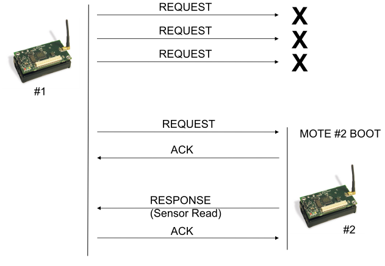

# TinyOS_Application
 Develope a TinyOS application in order to establish a connection between 2 motes to send data and simulate the application with TOSSIM.
 In this application there are 2 Micaz motes. The first mote sends periodic requests to second mote until it receives an acknowledgment.  Mote 1 starts at time 0 and mote 2 starts after 5 second. It should be mentioned that at first the second mote is off so basically the mote number one sends request to no one. But when the first request arrives because mode number 2 is booted, the mote number 1 also receives an acknowledgment for the request. After the mean time mote number 2 receives the response so it sends the response and mote number 1 receives the response and sends the ack. This request is periodic in every 1 second. The connection is as following:

This Request message contains the type which is response or request (1 for Response and 2 for Request) and each of the requests has a counter. The counter will send by mote number 1 and the value from the fake sensor (a random number is generated instead of the value of a real sensor). Also I use TinyOs ACK module to acknowledge each request or response.
The simulation is done in TOSSIM. TOSSIM is the TinyOS simulator. It’s a discrete event simulator. This means that it maintains a 
sorted queue of events. At each step the event with the oldest timestamp is extracted and executed. 
Each event can add new events to the queue. [In this document](http://didawiki.cli.di.unipi.it/lib/exe/fetch.php/rhs/tossim.manuale.pdf) you can find more information about TOSSIM.
